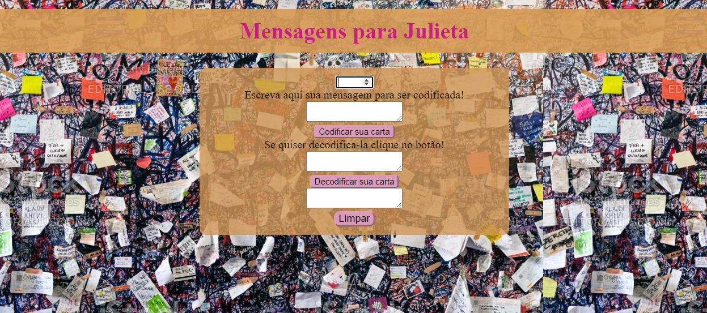

# Cifra de César

## Índice

* [1. Prefácio](#1-prefácio)
* [2. Resumo do projeto](#2-resumo-do-projeto)
* [3. Interface do projeto](#3-interface-do-projeto)
* [4. Considerações técnicas](#4-considerações-técnicas)

***

## 1. Prefácio

Primeiro desafio feito pela Laboratória, com o objetivo de proporcionar ao usuário um site na qual possa criptografar e descriptografar uma mensagem.

A [cifra de César](https://pt.wikipedia.org/wiki/Cifra_de_C%C3%A9sar)
é um dos primeiros tipos de criptografias conhecidas na história.
O imperador romano Júlio César utilizava essa cifra para enviar
ordens secretas aos seus generais no campo de batalha.

A cifra de César é uma das técnicas mais simples de cifrar uma mensagem. É um
tipo de cifra por substituição, em que cada letra do texto original é
substituida por outra que se encontra há um número fixo de posições
(deslocamento) mais a frente do mesmo alfabeto.

## 2. Resumo do projeto

Nesse projeto foi criado uma aplicação para que quando o usuário indicar qual deslocamento usar, uma mensagem será criptografada ou descriptografada. Foi escolhido o tema no qual o usuário poderá enviar uma mensagem para Julieta de forma criptografada. O projeto foi feito usando HTML, CSS e JavaScript.

## 3. Interface do projeto

Esse projeto tem o objetivo de oferecer ao usuário uma experiência pratica e segura, permitindo a ele escolher um offset que indique qual a posição que os caracteres precisam se deslocar para se fazer a criptografia ou descriptografia usando a cifra de cesar. Visualizando seus resultados ou podendo apagar o que foi feito.

## 4. Considerações técnicas

A lógica do projeto foi implementada inteiramente em JavaScript. Nesse projeto não foi permitido usar bibliotecas ou frameworks, só vanilla
JavaScript.

Para iniciar este projeto foi feito um _fork_ e _clone_ de um 
repositório, que contém um _boilerplate_ com testes. Um _boilerplate_ é a estrutura básica de um projeto que serve como ponto de partida com arquivos iniciais e configuração básica de dependências e testes.

Os testes unitários cobriram 92,59% dos _statements_, 100% das_functions_, 92% das _lines_, e 75% de _branches_. O _boilerplate_ já contem o setup e configurações necessárias para executar os testes assim como _code coverage_
para ver o nível de cobertura dos testes usando o comando `npm test`.

Verifique aqui como ficou o site: https://lilianscarabello.github.io/SAP011-cipher/ 
